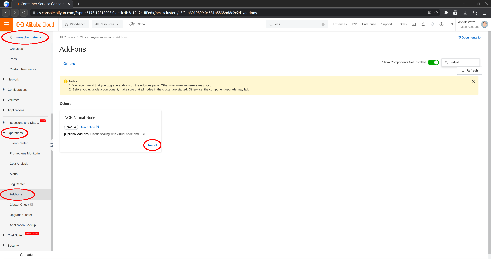
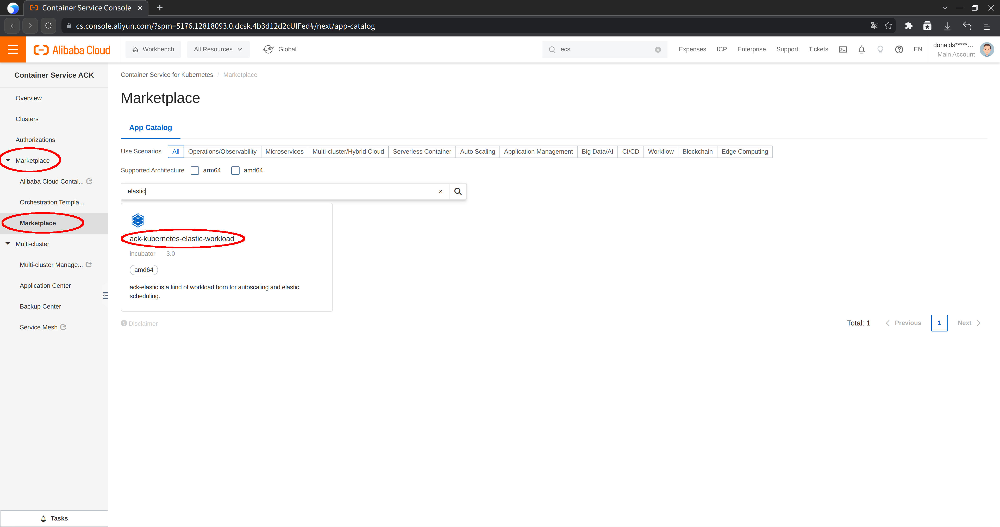
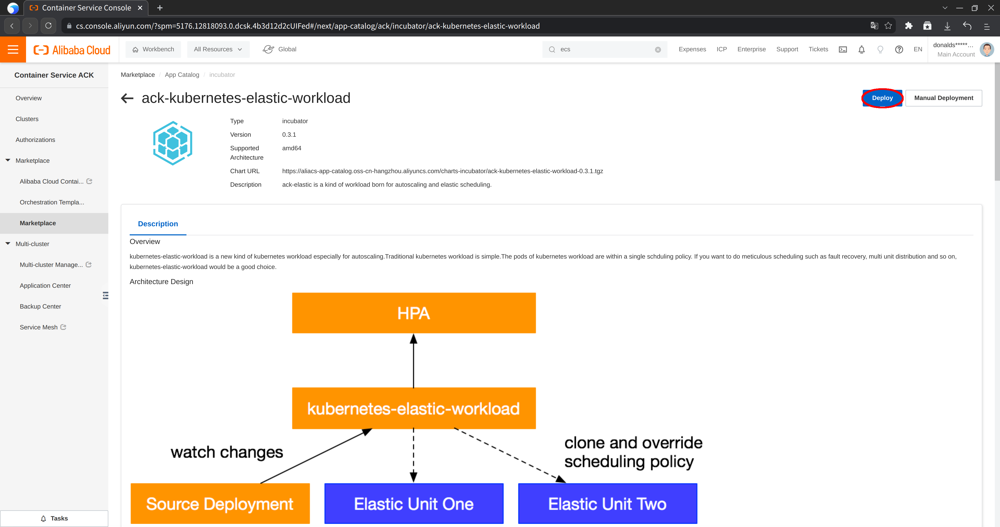
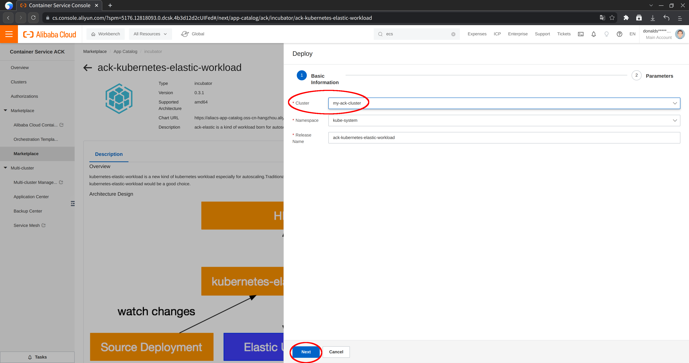
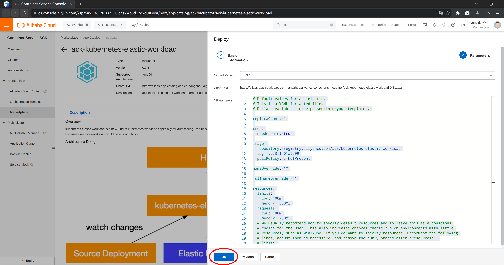

# aliyun-ack-ew-lab

Alibaba Cloud ACK lab on virtual node + ElasticWorkload + spot pricing

A detailed walkthrough of this lab is now available in Chinese on CSDN: https://blog.csdn.net/donaldsebleung/article/details/130913403

## Lab setup

Create an [Alibaba Cloud ACK](https://www.alibabacloud.com/product/kubernetes) cluster with the following specifications:

- Type: Standard
- K8s version: 1.26.3-aliyun.1
- CRI: containerd 1.6.20
- CNI: Terway with NetworkPolicy support
- VPC CIDR: 172.16.0.0/12
- Node, Pod vSwitch CIDR: 172.28.224.0/20
- Service CIDR: 192.168.0.0/16
- Worker nodes: 1
- Worker specifications: g6e.2xlarge (8 vCPU, 32 GiB)
- Worker base OS: Alibaba Cloud Linux 3.2104

It may take around 10 minutes to create the cluster. This single-node cluster can support a maximum of 48 Pods.

It is assumed that you have already set up a `kubectl` 1.26.3 client to connect to the cluster and have Git installed.

## Lab instructions

### Clone this repository and make it your working directory

```bash
git clone https://github.com/DonaldKellett/aliyun-ack-ew-lab.git
cd aliyun-ack-ew-lab/
```

### Create an NGINX deployment and test access

Choose one method below.

Declarative method:

```bash
# Create an nginx deployment with 2 replicas
kubectl apply -f objects/nginx.yaml
# Expose the nginx deployment as svc/nginx
kubectl apply -f objects/nginx-svc.yaml
# Create a pod/curlpod for curl access
kubectl apply -f objects/curlpod.yaml
# Test access to svc/nginx
kubectl exec curlpod -- curl -s nginx
```

Imperative method:

```bash
kubectl create deploy nginx --image=nginx --replicas=2 --port=80
kubectl expose deploy nginx
kubectl run curlpod --image=curlimages/curl -- sleep infinity
kubectl exec curlpod -- curl -s nginx
```

Before moving on to the next step, you may also wish to view the created objects related to the NGINX deployment - all of them are labelled `app=nginx`:

```bash
kubectl get svc,deploy,po -l app=nginx
```

### Install ACK virtual node and ElasticWorkload

To install [ACK virtual node](https://www.alibabacloud.com/help/en/container-service-for-kubernetes/latest/deploy-the-virtual-node-controller-and-use-it-to-create-elastic-container-instance-based-pods), select your cluster, then in "Operations > Add-ons", search for "ACK Virtual Node" and click "Install".



Next, install ACK [ElasticWorkload](https://www.alibabacloud.com/help/en/elastic-container-instance/latest/deploy-and-use-ack-kubernetes-elastic-workload-in-an-ack-cluster) controller:

1. In the ACK console, select "Marketplace > Marketplace", then search for "ack-kubernetes-elastic-workload" and select it
1. Select "Deploy" in the upper right hand corner
1. Select your cluster and leave other values at their defaults
1. Use the default parameters and click "OK"









### Deploy the NGINX ElasticWorkload

```bash
kubectl apply -f objects/nginx-ew.yaml
```

In the `nginx-ew.yaml` YAML file:

- `sourceTarget` specifies the Deployment to target - in this case, the `deploy/nginx` we created earlier. So now the structure becomes ElasticWorkload --> Deployment --> ReplicaSet --> Pods. `min: 0` and `max: 2` specify that our original deployment should have 0-2 replicas
- `replicas: 10` means our ElasticWorkload has 10 replicas in total, i.e. 2 from the original Deployment and 8 additional replicas will be created by our ElasticWorkload (via a new Deployment)
- `elasticUnit` specifies the properties of our additional ElasticWorkload-controlled Deployment. The name of the new deployment is of the form `<targetDeployment>-unit-<elasticUnitName>`, so in our case `nginx-unit-virtual-kubelet`. The `alibabacloud.com/eci=true` label schedules the replicas of the new Deployment to our virtual node which is backed by [Alibaba Cloud ECI](https://www.alibabacloud.com/product/elastic-container-instance). The `k8s.aliyun.com/eci-spot-strategy=SpotAsPriceGo` annotation leverages spot pricing for the workloads with no price cap

View details on our ElasticWorkload:

```bash
kubectl describe ew nginx
```

Observe that the 8 additional replicas are scheduled on the virtual node:

```bash
kubectl describe po -l app=nginx | grep Node:
```

You may also wish to confirm access to the NGINX service again:

```bash
kubectl exec curlpod -- curl -s nginx
```

### Confirm that spot pricing is being used

Apply a patch to our ElasticWorkload which sets a ridiculously low price cap for spot pricing:

```bash
kubectl patch ew nginx --type=merge --patch-file=patches/nginx-ew-patch.json
```

Wait a moment, maybe one minute, then observe that a few Pods are in the Pending state:

```bash
kubectl get po -l app=nginx | grep Pending
```

View the events of one of the Pods in Pending state, which should indicate that our price cap could not be satisfied:

```bash
export PENDING_POD="$(kubectl get po -l app=nginx | grep Pending | cut -d' ' -f1 | tail -1)"
kubectl describe po "${PENDING_POD}" | grep -A3 Events:
```
